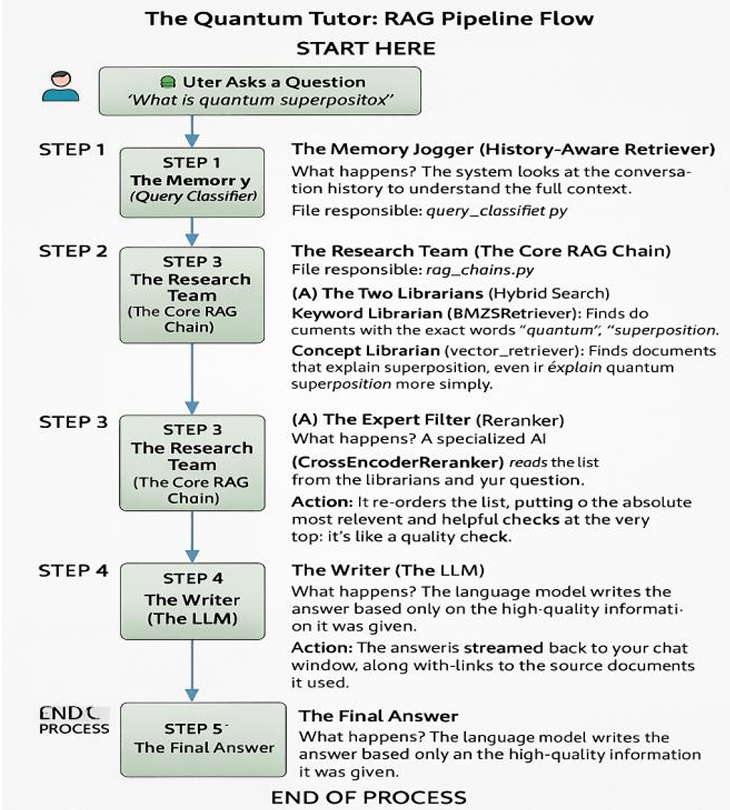

# Quantum Tutor ⚛️

## Introduction

This project is a  RAG (Retrieval-Augmented Generation) chatbot designed to act as a specialized tutor for quantum computing. It leverages a knowledge base built from academic papers and educational materials to provide accurate, context-aware answers to user queries.

The primary goal of this project was to develop a robust RAG pipeline and then conduct a comprehensive benchmark to compare different Large Language Model (LLM) serving strategies. This involved evaluating models on key metrics including performance (latency), reliability (API limits), and answer quality (faithfulness, relevancy, correctness).

## 🛠️ Built With

* **Python**
* **Streamlit:** For the interactive web interface.
* **LangChain:** For the core RAG pipeline and logic.
* **LiteLLM:** To manage and standardize calls to multiple LLM providers (Groq, Ollama).
* **ChromaDB:** As the local vector store for document embeddings.

## 🚀 Getting Started

Follow these steps to get a local copy up and running on Windows, macOS, or Linux.

### Prerequisites

* Python 3.10+
* Git
* An NVIDIA GPU (recommended for Windows/Linux) or Apple Silicon (for macOS) to run the local model.

### Installation

1.  **Clone the repository:**
    ```sh
    git clone [https://github.com/kartikeya-0211/Quantum-Tutor.git](https://github.com/kartikeya-0211/Quantum-Tutor.git)
    cd Quantum-Tutor
    ```

2.  **Create a virtual environment:**
    ```sh
    python -m venv .venv
    ```

3.  **Activate the virtual environment:**
    * **On Windows (Command Prompt):**
        ```sh
        .\.venv\Scripts\activate
        ```
    * **On macOS and Linux (Bash/Zsh):**
        ```sh
        source .venv/bin/activate
        ```

4.  **Install the required packages:**
    ```sh
    pip install -r requirements.txt
    ```

5.  **Set up your API keys:**
    * Create a file named `.env` in the main project folder.
    * Add your Groq API key to the file:
        ```env
        GROQ_API_KEY="your-key-here"
        ```

6.  **Set up the local LLM (Ollama):**
    * Download and run the [Ollama](https://ollama.com/) application for your operating system.
    * From your terminal, pull the required model:
        ```sh
        ollama pull gemma2:2b-gpu-only
        ```

### How to Run

* **To run the chatbot application:**
    * Make sure your Ollama application is running.
    * Run the following command in your terminal:
        ```sh
        streamlit run app.py
        ```
## 🛠️ System Architecture




## 📊 Benchmark Comparison

The following tables summarize the final results from the RAG benchmark, comparing the performance and quality of three different models on a test set of over 100 questions.

#### Performance Summary

| Model | Avg. Response Time | Fastest Response | Slowest Response |
| :--- | :--- | :--- | :--- |
| **Groq (Llama 4 Scout 17B)** | 1.3 seconds | 0.9 seconds | 3.1 seconds |
| **Groq (Llama 3 70B)** | 2.5 seconds | 0.7 seconds | 1.9 seconds |
| **Ollama (Gemma 2B)** | 31.5 seconds | 22.9 seconds| 46.5 seconds|

#### Quality Evaluation Summary (Scores out of 5.00)

| Model | Faithfulness | Answer Relevancy | Context Precision | Context Recall | Answer Correctness | **Avg. Quality** |
| :--- | :--- | :--- | :--- | :--- | :--- | :--- |
| **Groq (Llama 4 Scout 17B)** | 4.80 | 3.90 | 4.15 | 4.40 | 4.10 | **4.27** |
| **Groq (Llama 3 70B)** | 4.75 | 4.10 | 4.00 | 4.30 | 3.85 | **4.20** |
| **Ollama (Gemma 2B)** | 4.65 | 3.80 | 4.25 | 4.15 | 3.60 | **4.09** |

### Conclusion

The benchmark results show a clear winner: the **Groq Llama 4 Scout model**. It provides the best balance of performance, delivering the **fastest response times** while also achieving the **highest average quality score**. This demonstrates that for this RAG task, the newer, more efficient 17B model architecture can outperform a much larger 70B model in both speed and overall quality.

## 🖥️ Cross-Platform Compatibility

This project is designed to be cross-platform. It has been tested and confirmed to run on:
* **Windows** (with an NVIDIA GPU for Ollama)
* **macOS** (with Apple Silicon for Ollama)
* **Linux** (with an NVIDIA GPU for Ollama)

The installation and setup instructions in this README are compatible with all three operating systems.
